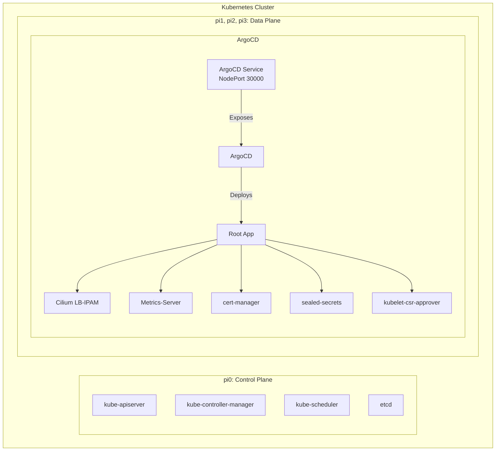
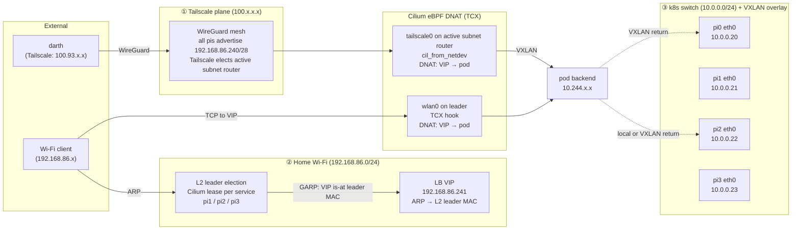

# Homekube

Running Upstream Kubernetes on Raspberry Pi.

---


---

<div style="display: flex; justify-content: space-around;">
  
  
  
</div>

---

<div style="display: flex; justify-content: space-around;">
  
  
  
</div>

---
<div style="display: flex; justify-content: space-around;">
  
  
</div>

---


---

<!-- TOC -->
* [Overview](#overview)
* [Setup](#setup)
* [References / Inspiration](#references--inspiration)
<!-- /TOC -->

---

## Overview

### Components

| Component | Package | Version |
|-|-|-|
| Kubernetes | `k8s` | _1.34.1_ |
| CRI | `containerd` | _2.1.4_ |
| | `runc` | _1.1.5_ |
| CNI | `cilium` | _1.18.2_ |
| | `containernetworking-plugins` | _1.1.1_ |
| CSI | `longhorn` | _1.9.1_ |

### Nodes

| Hostname | Device         | OS                         | Architecture | Boot | Tailscale | k8s IP     |
|----------|----------------|-----------------------------|--------------|------|-----------|------------|
| pi0      | RPi 5, 8GB     | Raspberry Pi OS Lite 64bit | aarch64      | NVMe | pi0       | 10.0.0.20  |
| pi1      | RPi 5, 8GB     | Raspberry Pi OS Lite 64bit | aarch64      | NVMe | pi1       | 10.0.0.21  |
| pi2      | RPi 5, 8GB     | Raspberry Pi OS Lite 64bit | aarch64      | NVMe | pi2       | 10.0.0.22  |
| pi3      | RPi 5, 8GB     | Raspberry Pi OS Lite 64bit | aarch64      | NVMe | pi3       | 10.0.0.23  |

**Management access:** Tailscale (100.x.x.x MagicDNS) from darth. **k8s networking:** Physical switch (10.0.0.x); Tailscale invisible to Kubernetes.

### Kubernetes Network Architecture

| Network | CIDR | Component |
|-|-|-|
| Pod Network | 10.244.0.0/16 | kubeadm / ClusterConfiguration + Cilium |
| Service Network | 10.96.0.0/12 | kubeadm / ClusterConfiguration |
| Cluster DNS | 10.96.0.10 | kubeadm / KubeletConfiguration |
| LB VIP pool | 192.168.86.241–251 | Cilium LB-IPAM (`CiliumLoadBalancerIPPool`) |

### Kubernetes Cluster Architecture



### Network Architecture

Three independent network planes serve different purposes:



**Tailscale path** (reliable): darth → WireGuard → active subnet router (any pi, `tailscale0`) → Cilium DNAT → pod. Return via VXLAN if pod is on a different node.

**Wi-Fi path** (best-effort): client ARPs for VIP → L2 leader (one of pi1/2/3, elected via Kubernetes lease) responds with its `wlan0` MAC → client sends TCP to leader's `wlan0` → Cilium TCX hook DNATs to pod. Intermittently disrupted by wireless link variability and Cilium BPF reload windows.

## Setup

⚠️ The following steps outline the tasks required to install Kubernetes on _my_ Raspberry Pi cluster. It's likely that _your_ cluster is different. Use this repository as a guide, but don't expect every step to work for your system. ⚠️

Follow the phases in order:

1. [Phase 1: Bootstrap](./docs/01_bootstrap.md) — Imager + Tailscale + WiFi
2. [Phase 2: NVMe Migration](./docs/02_nvme.md) — SD → NVMe boot (Ansible automation)
3. [Phase 3: Ansible Provisioning](./docs/03_ansible.md) — Create homekube user, base packages
4. [Phase 4: Kubernetes Install](./docs/04_kubernetes.md) — kubeadm + Cilium
5. [Phase 5: GitOps](./docs/05_gitops.md) — ArgoCD + App-of-Apps
6. [Apps deployment](https://github.com/jangroth/homekube-apps) — ArgoCD applications (Cilium LB, Longhorn, monitoring)

### Quick update

```shell
# Via Task (preferred — runs from homekube-main/)
task update-all

# Or directly
cd ansible
uv run ansible-playbook 20-configure-darth.yml --tags update-only
uv run ansible-playbook 22-k8s-nodes.yml --tags update-only
```

## References / Inspiration

* [Kubernetes the hard way](https://github.com/kelseyhightower/kubernetes-the-hard-way/tree/master) - Kelsey Hightower
* [Pi Kubernetes Cluster](https://picluster.ricsanfre.com/docs/home/) - Ricardo Sanchez
* [k8s-gitops](https://github.com/xunholy/k8s-gitops) - Michael Fornaro
