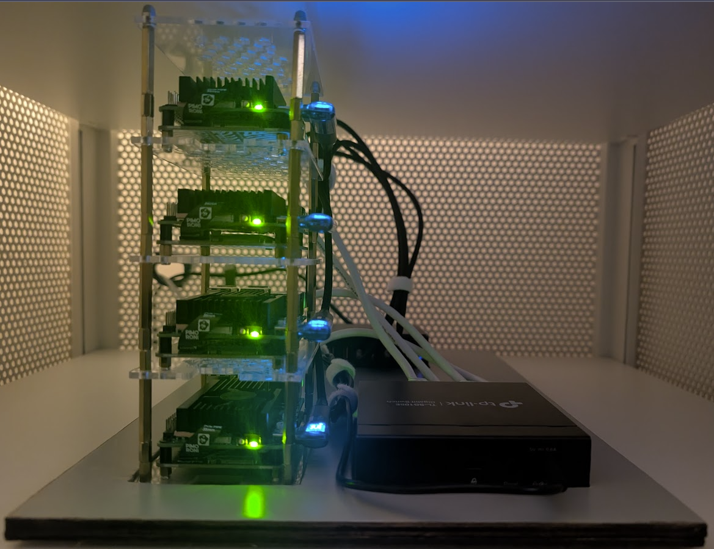
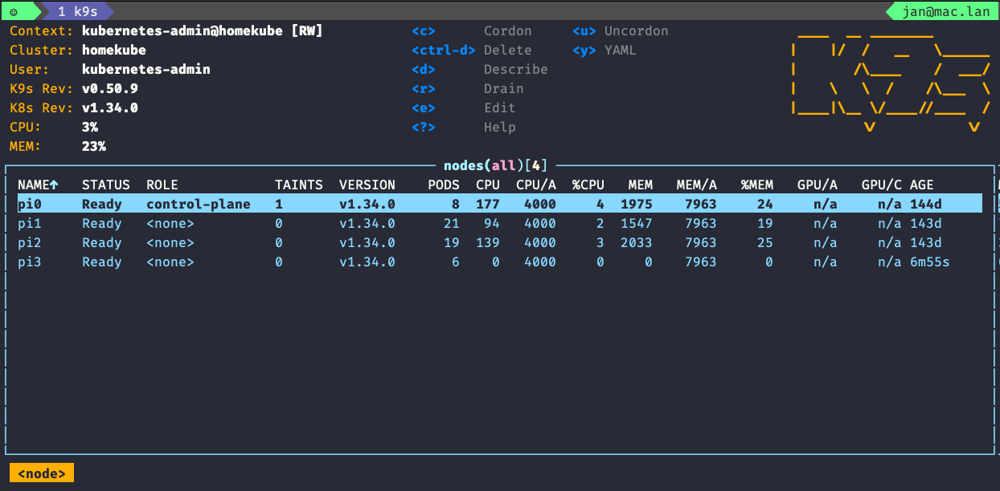

# Homekube

Running Upstream Kubernetes on Raspberry Pi.

---



---

<div style="display: flex; justify-content: space-around;">
  
  
  
</div>

---

<div style="display: flex; justify-content: space-around;">
  
  
  
</div>

---
<div style="display: flex; justify-content: space-around;">
  
  
</div>

---



---

<!-- TOC -->
* [Overview](#overview)
* [Setup](#setup)
* [References / Inspiration](#references--inspiration)
<!-- /TOC -->

---

## Overview

Cluster topology, network architecture, and component/version tables now live in the top-level [`homekube` README](../README.md) — this repo only covers what's specific to provisioning it.

## Setup

⚠️ The following steps outline the tasks required to install Kubernetes on _my_ Raspberry Pi cluster. It's likely that _your_ cluster is different. Use this repository as a guide, but don't expect every step to work for your system. ⚠️

Follow the phases in order:

1. [Phase 1: Bootstrap](./docs/01_bootstrap.md) — Imager + Tailscale + WiFi
2. [Phase 2: NVMe Migration](./docs/02_nvme.md) — SD → NVMe boot (Ansible automation)
3. [Phase 3: Ansible Provisioning](./docs/03_ansible.md) — Create homekube user, base packages
4. [Phase 4: Kubernetes Install](./docs/04_kubernetes.md) — kubeadm + Cilium
5. [Phase 5: GitOps](./docs/05_gitops.md) — ArgoCD + App-of-Apps
6. [Apps deployment](https://github.com/jangroth/homekube-apps) — ArgoCD applications (Cilium LB, Longhorn, monitoring)

### Quick update

```shell
# Via Task (preferred — runs from homekube-main/)
task update-all

# Or directly
cd ansible
uv run ansible-playbook 20-configure-darth.yml --tags update-only
uv run ansible-playbook 22-k8s-nodes.yml --tags update-only
```

## References / Inspiration

* [Kubernetes the hard way](https://github.com/kelseyhightower/kubernetes-the-hard-way/tree/master) - Kelsey Hightower
* [Pi Kubernetes Cluster](https://picluster.ricsanfre.com/docs/home/) - Ricardo Sanchez
* [k8s-gitops](https://github.com/xunholy/k8s-gitops) - Michael Fornaro
